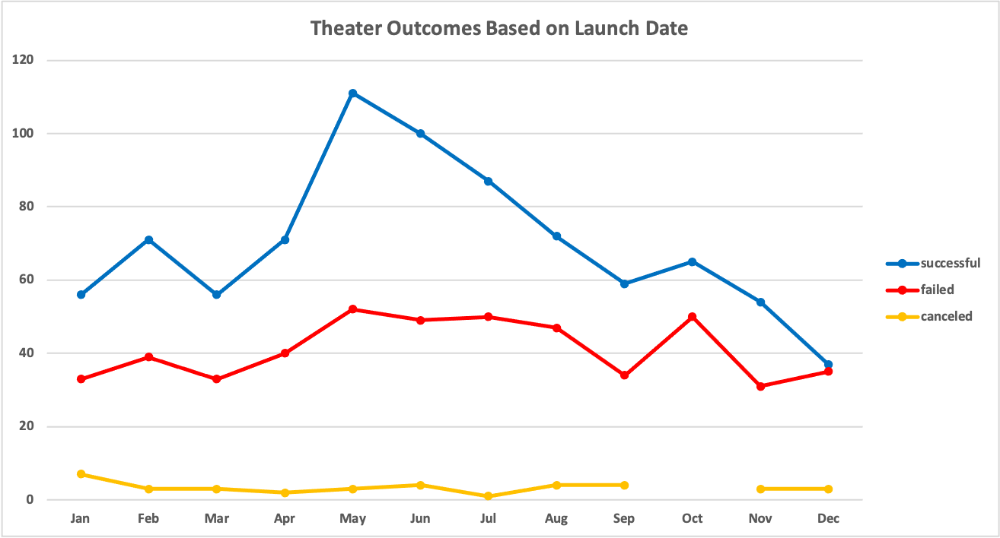
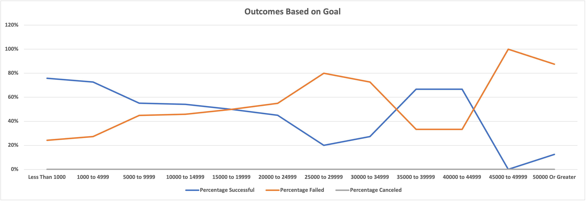
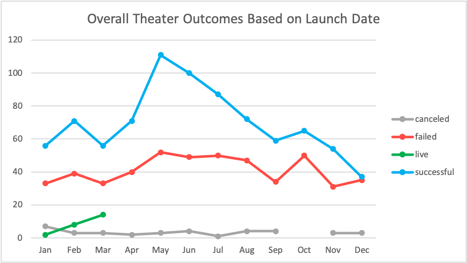
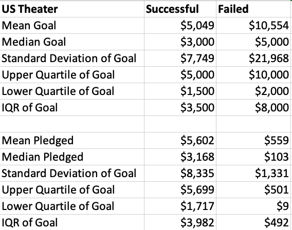
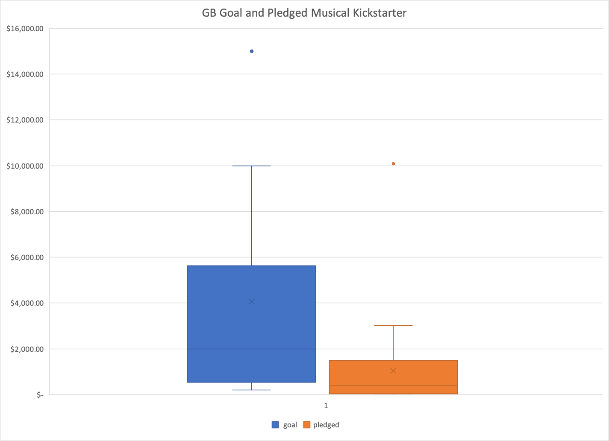

# Kickstarting with Excel - Deliverable3

## Overview of Project
This project was to help Louise know if the Theater category and Play subcategory projects had a strong correlation with launch date and reaching their goals.  Louise followed up to original questions of Kickstarter data that included looking overall at more general questions such as how the different campaign categories compared to each other in the US and Great Britain, a closer look at four Great Britain plays, and a recommendation of how likely backers would fund Louise's play with a goal of $10,000 based off of past campaign data. While this analysis won't reiterate the previous request, keeping the original ask in mind while developing new insights using the same data set is essential.

### Purpose
The purpose of this analysis is to see if and when the launch date affects a campaign's outcomes specific to Theater and Play Kickstarter projects and to see if there was a monetary goal range that had more success over others.  

### Analysis 
The first task to look at the Theater category was to create a years column using the formula =YEARS(Data Created Conversion cell) for each cell in the column Date Created Conversion after filtering the parent category to show Theater. Once the entire Years column was populated, a pivot table was inserted into a new sheet with Parent Category filtered to the Theater and all years included in the filter. Outcomes were placed in the rows and values with Date Created Conversion in the Columns. Once the original pivot table was created, there were a few tweaks needed before graphing the chart. The first step taken was a right-click on quarters to go to group -> months and then press okay. Now, instead of seeing quarters, months were shown. Under the Column Labels, sorting descending on outcomes to show successful, failed, canceled, and Grand Total in order.  The last few sorts and edits included filtering out the live outcomes and make sure the months were in ascending order. From this, the line graph was created to visualize the pivot table. 

Outcomes-Based on Goals required more formulas than the prior chart. After making a table on a new sheet with goals by increments of $5,000, a COUNTIFS formula was needed for a number of successful, failed, and canceled plays. The first column, successful play campaigns under 1000 had a formula of =COUNTIFS(Kickstarter!$D$1:$D$4115,"<1000", Kickstarter!$R$1:$R$4115," plays," Kickstarter!$F$1:$F$4115, "successful") and this was copied down the column with the criteria modified to match the row with the corresponding goal.  This formula was also the base for the next two columns, failed and canceled, with the "successful" criteria changed base on the column it was in. The difficulty with this formula was making sure the "$" were entered correctly and the commas not to produce an error.  After getting it correct the first time, there was no need to re-create it from scratch. 

The next column was much more straightforward, only a sum of the first three columns was needed in which the formula "=SUM(B2:D2)" was used, or a sum of Successful, Failed, and Canceled campaigns for each Goal range. Before moving on to the percentages, a confirmation that the data pulled in for the first three columns was confirmed by going to the Kickstarter tab, filtering subcategory to "plays" and outcomes to either "successful," "failed," or "canceled" and looking at the total in the graph. The total count in the data 1047 confirmed that the formulas were accurate in capturing all the worksheets' data. 

The last task was to look at percentages where a ROUND formula was added to the percentage formula, =ROUND(D2/E2,2), which was done for each of the three columns compared to the total column and copied down until all cells for each goal were calculated. This assured that the decimal places had a cap after dividing each column's number by the total plays. Then the last three columns were formatted to a percentage. 

The last step was to create a line graph of each goal range and the percentage of successful, failed, and canceled to visualize the table. 

### Analysis of Outcomes Based on Launch Date
For the Theater Outcomes Based on the Launch Date chart show that May was the month with the highest amount of successful campaigns and December had the lowest amount of success. May also had the highest difference between successful campaigns and failed campaigns, but the number of successful campaigns fell in the subsequent months. Still, the number of failed campaigns stayed consistent, meaning that after May, the later it got in the year, the higher chance a theater campaign was going to fail until December where the total amount of theater campaigns succeeding and failing were about the same amount. The other type of campaign graphed were canceled campaigns that stayed steady throughout the year, except for October that had no theater campaigns canceled. 

### Analysis of Outcomes Based on Goals
The Outcomes Based on Goals chart by campaign outcomes based on campaign goals tells an exciting story. At first glance, it shows that the two smallest campaign goals (Less than 1,000 and 1,000 -4,999) had the highest success rate followed closely by the 35,000-39,999 and 40,000 - 49,999. Digging a little deeper and looking at the chart and the table, the story shifts slightly when looking at the total number of campaigns. The first two gaols (Less than 1,000 and 1,000 -4,999) had campaigned 186 and 534, respectively. The second-highest successful campaign percentage, 35,000-39,999 and 40,000 - 49,999, had a total of 6 and 3 total campaigns, respectively. Seeing such a lower sample put the percentages into perspective that although the 35,000-39,999 and 40,000 - 49,999 had the third and fourth highest success rate, with such a low total of plays tracked, the graph may be a bit misleading looking at a small number of campaigns. Sorting looking by the number of successful columns in descending order, both 35,000-39,999 and 40,000 - 49,999 were in the bottom half of the sort or other words, over half of the other goals had more successful play campaigns than the 35,000-39,999 and 40,000 - 49,999 ranges. 

A similar finding is valid for the percentage of failed plays. The graph shows that the 45,000 - 49,999 had a 100% failure rate, but looking at the total number of plays, only one project was attempted for that goal range. The much stronger conclusion is the next highest campaign rate. 50,000 or higher has a failure rate of 88%, but there were 16 total projects, which means it has a much higher chance of being a valid trend in the future compared to the only one project in the 45,000 - 49,999 range. 

The percentage canceled was 0 for each category and may be considered removing and notating this graph. It doesn't add to the story or provide any insights other than no projects were canceled under this data set's plays category.

### Challenges and Difficulties Encountered
During this analysis, the challenges encountered included checking the goal amount and the formulas to match the Outcomes Based on Goal Table. The research needed to be precise about the data selected and make sure there weren't too many or few digits in the formulas entered that included multiple identical numbers.  
 

## Results

### Results Theater Outcomes by Launch Date

A conclusion about the Theater Outcomes by Launch Date is that May is the month with the most successful campaigns and that after May, success steadily decreases until October.  Another result is that May-August had a consistent number of failed campaigns and that in December, there was about an even chance of a play being successful as there was it was going to fail.

### Results Outcomes based on Goals
For the Outcomes-based on Goals, although the success and failure percentages dip and spike over the different amounts, a safe conclusion is that the smaller goals had a higher chance of succeeding, and larger goals had a higher chance of failing in terms of percentages. 

### Data set Limitations
A few of this dataset's limitations are that it has not been updated since the original analysis is done. This means that Louise's new play Fever and other plays that are still marked live could be excluded as it is not up to date. Another consideration is if there are different promotion or marketing strategies implemented to influence a campaigns' success that is not included in the data. It would also be interesting to determine if there are any reoccurring backers among different campaigns and if their donations differ depending on the parent or subcategory. Lastly, the percentages based on outcomes could be slightly misleading looking at percentages only; for example, the percentage failed for the 45000 to 4999 category was 100%, but there were only one failed campaign and none successful. It would be easy to assume that the 45000 - 49999 goal was the least successful, but there are not enough campaigns to draw that conclusion as absolute; what would be fairer to say is the least amount of campaigns run with a goal from 45000 to 49999. 

### Possible Future Additions
Other possible future deliverables could be looking at different countries separately and year over year comparisons to see any similar or different trends. Other graphs that may help get a closer look to see if staff picks or graphing other factors like length of campaign, spotlight, and staff pick to see if they impacted the outcome.

# An Analysis of Kickstarter Campaigns - Excercise 1.6.1 
Performing analysis on Kickstarter data to uncover trends

Out of a total of 912 theater campaigns in the US, 58% of them have been successful while 38% have failed. We can approach this cautiously optimistic that the parent category trend tips towards a positive result. 

Still looking at the theater category in the US we can give an estimate on which month in the year may have the highest rate of success. In the past, May had the largest number of successful plays and also the highest percent (68%). It should be noted that January, June, July and October all had about the same number of failed campaigns launched. 

This trend is similar to the theater trend overall, which hits its highest success in June and then steadily decreased throughout the end of the year. 

Another interesting find regarding the how the different parent categories under theater did in Great Britain, was that plays had the highest total number of campaigns and the most successful campaigns.

Foresight was a play that Louise mentioned she enjoyed in GB. Looking at that play specifically, we can see that it was successful in achieving its $2,000 goal and that it ran from a short time frame, from the end of April to mid May, which is around the time most plays are successful. Another takeaway from Foresight was that there were only 17 backers and that the average donation was about $118.  

The other specific plays that were brought up were Be Prepared, Checkpoint 22, Cutting Off Kate Bush, Jestia and Raedon, and Hitchhiker’s Guide to the Family. All five plays exceeded their goals, but most of the goals were in the $1,000-$2,000 range with only Hitchhiker’s Guide to the Family at $4,000.  The average donation was between $33-$52 and the number of backers ranged from 26 for the lowest goal campaign to 113 for the highest goal campaign. 

Looking through the data, there were some worrisome information that Louise should definitely be aware of. Louise currently has a goal of over twice the average successful Kickstarter campaign which means she may want to adjust her goal or make sure she is able to secure high amount donations or backers.  One thing to note about Kickstarter strategy is that the mean and median pledged for failed campaigns were much lower than successful ones which could allude that failed campaigns are not due to backers being asked for too much money, there are other factors that are determining if a theater campaign is successful or not.  

A deeper dive into the US Theater Statistics helps us determine that since the Standard Deviation Goal is over twice the IQR goal, there must be some outliers of failed campaigns with really high goals that are causing this substantial difference. 
Louise also mentioned that she’s interested in Great Britain for a future musical project with an estimated budge of £4,000.  After comparing the average Great Britain goal of £4,000 and the average pledged of £2,000, it is safe to assume that the £4,000 is pretty high and although there are some outliers that is skewing the distribution, it would be safer to have a smaller goal, especially considering that ¼ of campaigns are receiving no funding at all. 

